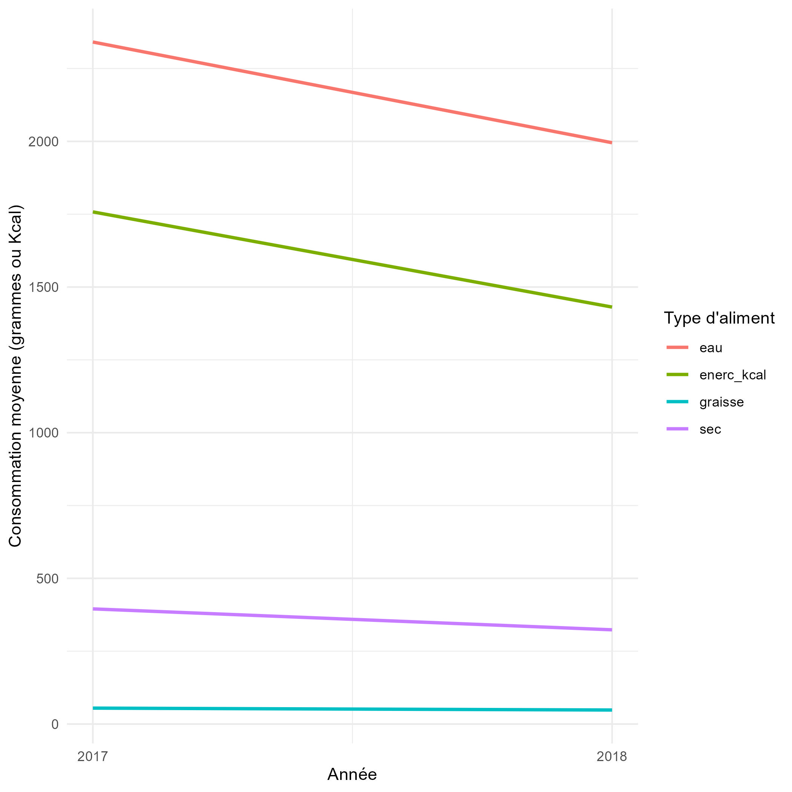
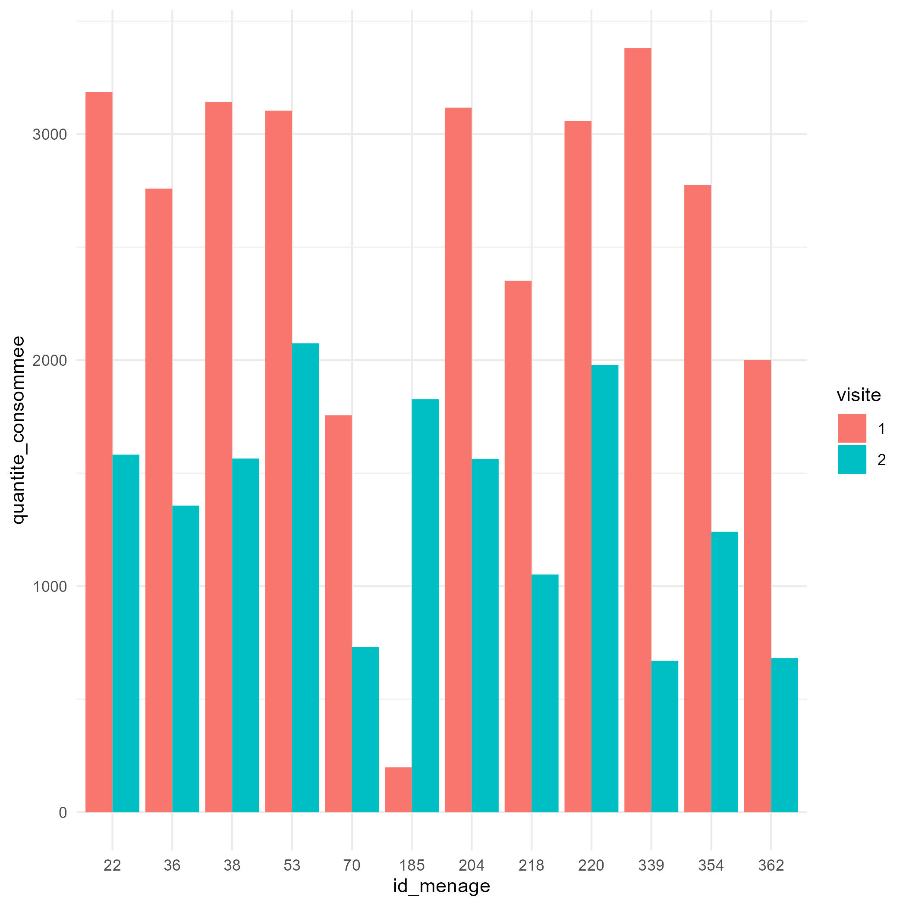

```{r include = FALSE}
knitr::opts_chunk$set(message = F)
```

# Données : Diversité alimentaire au Vietnam

Pour commencer, chargez les packages nécessaires : {tidyverse}, {here}, et {esquisse}.

```{r}
# Charger les packages nécessaires
pacman::p_load(tidyverse, here, esquisse)
```


```{r}
# Importer le jeu de données
donnees_large <- read_csv(here("data/diversite_alimentaire_vietnam_large.csv"))

# Aperçu du data frame
donnees_large
```

**Checkpoint:** Le data frame importé devrait avoir 61 lignes et 9 colonnes.

Ce sous-ensemble des données originales contient des informations sur 61 ménages. Chaque ménage a été visité deux fois, et les données suivantes ont été enregistrées :

-   Quantité de matière sèche consommée (g)

-   Quantité d'eau consommée (g)

-   Quantité d'énergie consommée (Kcal)

-   Quantité de lipides consommée (g)

Pour chacune de ces mesures, il y a 2 colonnes correspondantes dans le jeu de données. Les mesures de la première visite sont indiquées par un suffixe `_1` dans le nom de la colonne, et les mesures de la deuxième visite sont indiquées par un suffixe `_2`.

Gardez à l'esprit que le jeu de données brut est dans un format LARGE. Nous devons le pivoter en format LONG afin de réaliser des visualisations, comme démontré avec les données fictives ci-dessus.

# Pivoter les données

Bien que les tâches d'analyse de données de base telles que la recherche de la moyenne, etc. soient possibles sur des ensembles de données au format large, le code est souvent plus long et implique davantage d'étapes de manipulation fastidieuses.

Les ensembles de données au format long sont optimaux pour la majorité des tâches d'analyse de données.

**VOTRE OBJECTIF**: Manipuler le data frame `donnees_large` en format long, où les premières lignes ressemblent à ceci :

| id_menage | type_aliment | visite | quantite_consommee |
|-----------|--------------|--------|--------------------|
| 348       | enerc_kcal   | 1      | 2268.140795        |
| 348       | enerc_kcal   | 2      | 1385.754679        |
| 348       | sec          | 1      | 547.531613         |
| 348       | sec          | 2      | 280.751365         |
| 348       | eau          | 1      | 4219.325686        |
| 348       | eau          | 2      | 1996.918553        |
| 348       | graisse      | 1      | 78.404239          |
| 348       | graisse      | 2      | 67.725305          |

**Astuce** : Commencez par identifier un séparateur unique dans le data frame large que vous pouvez utiliser pour `names_sep`. Ensuite, utilisez `names_to` et `values_to` pour attribuer les noms de colonnes corrects. Référez-vous à la section de démonstration ci-dessus pour le code d'exemple !

```{r}
# mauvais
donnees_longues <- pivot_longer(donnees_large,
             cols = 2:9,
             names_sep = "_s_",
             names_to = c(".value", "visite"))

# bien
donnees_longues <- pivot_longer(donnees_large,
             cols = 2:9,
             names_sep = "_s_",
             names_to = c("type_aliment", "visite"))

# meilleur nommage
donnees_longues <- pivot_longer(donnees_large,
             cols = 2:9,
             names_sep = "_s_",
             names_to = c("type_aliment", "visite"),
             values_to = "quantite_consommee")

# Afficher le data frame
donnees_longues
```

**Checkpoint:** `donnees_longues` devrait avoir 488 lignes et 4 colonnes.

Le jeu de données au format long nous permet de réaliser des visualisations qui n'étaient pas facilement possibles avec les données au format large. Par exemple, nous pouvons créer un diagramme à colonnes comme ceci :

```{r}
# Exemple de tracé
ggplot(donnees_longues) +
  aes(x = visite, y = quantite_consommee, fill = type_aliment) +
  geom_col() +
  theme_minimal() 
## Si vous avez des difficultés à exécuter ce code, assurez-vous que votre data frame et vos colonnes sont nommés conformément aux instructions.
```

# Pratique supplémentaire en utilisant les verbes `{dplyr}`!

Chaque ménage dans les données a été visité deux fois : la visite 1 était en 2017 et la visite 2 était en 2018. Utilisez une fonction appropriée de `{dplyr}` pour créer une nouvelle colonne appelée "annee" et attribuer les valeurs 2017 ou 2018 en fonction du numéro de visite.

```{r}
# Ajouter une colonne "année"
donnees_longues_propre <- donnees_longues %>% 
  mutate(annee = case_when(visite == 1 ~ 2017, 
                            TRUE ~ 2018))

# OU
donnees_longues %>% 
  mutate(annee = 
      case_when(visite == 1 ~ 2017,
         visite == 2 ~ 2018))

# OU avec if_else()
donnees_longues_propre <- donnees_longues %>%
  mutate(annee = if_else(visite == 1, 2017, 2018))

donnees_longues_propre
```

Ensuite, utilisez un regroupement imbriqué pour créer un tableau de synthèse qui calcule la quantité moyenne consommée pour chaque type d'aliment et chaque année.

```{r}
# Tableau de synthèse
resume_regime <- donnees_longues_propre %>% 
  group_by(annee, type_aliment) %>% 
  summarize(moyenne_consommation = mean(quantite_consommee))  %>% 
  ungroup()

# Afficher le tableau récapitulatif
resume_regime
```

**Checkpoint:** Le tableau de synthèse devrait avoir 8 lignes et 3 colonnes. N'oubliez pas de dégrouper vos données après la synthèse pour éviter les erreurs futures !

# Visualiser les données avec {esquisse}

En utilisant `esquisse`, tracez un graphique en ligne comparant comment la consommation moyenne de chaque type d'aliment évolue entre 2017 et 2018.

**Astuce** : Un graphique en ligne nécessite deux variables numériques pour les axes x et y. Vous pouvez séparer les quatre types d'aliments par couleur. Votre graphique final peut ressembler à la consommation_alimentaire.jpg (voir le dossier data).



```{r eval = F}
# esquisser(resume_regime)
ggplot(resume_regime) +
 aes(x = annee, 
     y = moyenne_consommation, 
     color = type_aliment) +
 geom_line(linewidth =1) +
 theme_minimal() +
  scale_x_continuous(n.breaks = 2) +
  labs(x = "Année", y = "Consommation moyenne (grammes ou Kcal)",
       color = "Type d'aliment")
```

# Enregistrer les sorties

Enfin, enregistrez votre dernier data frame et votre graphique dans les formats de fichiers corrects dans un dossier "outputs".

```{r eval = F}
# Enregistrer les données
write_csv(donnees_longues_propre, here("outputs/donnees_longues_propres.csv"))

# Enregistrer le graphique
ggsave(here("outputs/consommation_alimentaire.jpg"))
```

# Défi (optionnel)

1.  Identifier les 12 ménages qui ont eu une différence de plus de 1000 kilocalories entre leurs mesures de consommation d'énergie à la visite 1 et à la visite 2 (`enerc_kcal`).

    Vous pouvez identifier ces ménages en utilisant soit le jeu de données long, soit le jeu de données large. Si vous choisissez d'utiliser le jeu de données au format long, vous devrez peut-être utiliser la fonction `diff()` de `{dplyr}`.

2.  Créer un graphique comparant la consommation d'énergie de ces 12 ménages pour la visite 1 par rapport à la visite 2 en utilisant `esquisse`. Par exemple, vous pourriez créer un diagramme à barres groupées comme ceci :

    

    Pour un tel graphique, il sera plus facile d'utiliser le jeu de données au format long.


```{r eval = FALSE}

# Obtenir les identifiants de ménage
ids <-  donnees_longues_propre %>%
  filter(type_aliment == "enerc_kcal") %>%
  group_by(id_menage) %>%
  summarize(diff = abs(diff(quantite_consommee))) %>% # DOIT UTILISER ABS POUR OBTENIR 12
  filter(diff > 1000)  %>% 
  pull(id_menage) %>% 
  unique()

## OU VOUS POUVEZ COMMENCER AVEC LES DONNÉES LARGE :
#
#ids <-  
#  donnees_large %>% 
#  mutate(diff = abs(enerc_kcal_s_2 - enerc_kcal_s_1)) %>% 
#  filter(diff > 1000)  %>% 
#  pull(id_menage) %>% 
#  unique()

# Filtrer le jeu de données principal pour ne conserver que ces 12 ménages
regime_long_ensemble <- 
  donnees_longues_propre %>% 
  filter(id_menage %in% ids,
         type_aliment == "enerc_kcal") %>% 
  mutate(id_menage = factor(id_menage))

# Tracer

#esquisse::esquisser(regime_long_ensemble)

ggplot(regime_long_ensemble) +
  aes(x = id_menage, y = quantite_consommee, fill = visite) +
  geom_col(position = "dodge") +
  theme_minimal()
```
