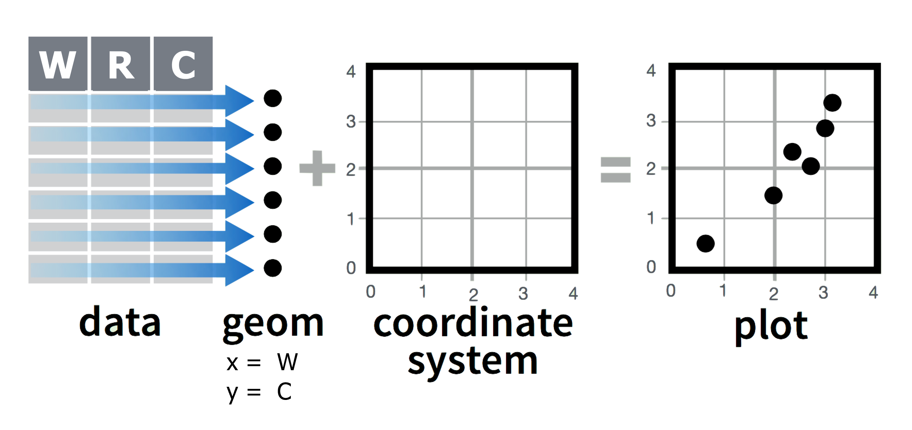

# Introduction

Bienvenue !

Cet atelier est une approche pratique de la visualisation de données et de la révision de certaines fonctions {dplyr} avec lesquelles vous êtes déjà familier.

Les notes de cours de cette semaine sont liées ci-dessous. Elles peuvent être très utiles pour accomplir l'exercice, n'hésitez donc pas à vous y référer pendant l'atelier !

- [Introduction à ggplot2](https://the-graph-courses.github.io/data_on_display_wp/lessons/fr_ls01_gg_intro.html)

- [Graphiques de dispersion et lissage](https://the-graph-courses.github.io/data_on_display_wp/lessons/fr_ls02_scatter.html)

# Configuration pour l'exercice

1. **Téléchargez d'abord le dépôt sur votre ordinateur local.** Pour commencer, téléchargez, décompressez et parcourez le dossier d'exercice.

2. **Ouvrez le projet RStudio** en cliquant sur le fichier *.Rproj* pertinent dans le dossier de l'atelier décompressé. Assurez-vous d'avoir ouvert week_08_workshop.Rproj dans RStudio en regardant le nom de votre fenêtre RStudio, ou dans le coin supérieur droit de votre écran.

3. **Ouvrez le fichier Rmd de l'exercice.** Accédez à l'onglet Fichiers dans RStudio et ouvrez le dossier "rmd". Vous travaillerez dans le fichier appelé "week_08_exercise.Rmd". Cet Rmd contient à la fois les instructions et l'exercice de l'atelier dans un seul fichier.

4. **Complétez l'exercice.** Suivez les étapes dans "week_08_exercise.Rmd". Remplacez chaque instance de `"ÉCRIVEZ_VOTRE_CODE_ICI"` par vos réponses. L'exercice doit être soumis individuellement, mais vous êtes encouragé à réfléchir en groupe. Bien que vous soyez autorisé à travailler avec des membres du groupe, *il est important que tout le code que vous soumettez soit tapé par vous-même*.

# Qu'est-ce que les Graphiques à Bulles?

Un **graphique à bulles** est un type de graphique de dispersion où une troisième dimension est ajoutée : une variable numérique supplémentaire est représentée par la **taille** des points.

En février 2006, un médecin suédois et défenseur des données nommé Hans Rosling a donné une célèbre conférence TED intitulée ["Les meilleures statistiques que vous ayez jamais vues"](https://www.ted.com/talks/hans_rosling_shows_the_best_stats_you_ve_ever_seen) où il a présenté des données économiques, sanitaires et de développement mondiales compilées par la Fondation Gapminder.

La conférence présentait un célèbre graphique à bulles similaire à celui-ci :


Ici, les points affichent une relation entre deux variables numériques sur chaque axe, ainsi qu'une troisième variable numérique : la taille de la bulle représente la population.

Remarquez que l'axe des x utilise une échelle logarithmique, pas une échelle linéaire. Cela permet d'éviter d'encombrer les points. Dans cet exercice, nous allons transformer les axes de notre graphique afin de reproduire le graphique à bulles de Gapminder aussi fidèlement que possible.

# Packages

Pour commencer, **chargez les packages nécessaires** : {tidyverse}, {here}, {plotly} et {gapminder}.

```{r}
# Charger les packages
"ÉCRIVEZ_VOTRE_CODE_ICI"
```

# Données Gapminder

Le package R {gapminder}, que nous venons de charger, contient des données économiques, sanitaires et de développement mondiales compilées par la Fondation Gapminder.

Exécutez le code suivant pour charger le cadre de données `gapminder` du package {gapminder} :

```{r message = FALSE}
# Indiquez à R d'obtenir le cadre de données intégré du package
data(gapminder, package="gapminder")

# Afficher le cadre de données
gapminder
```

Chaque ligne de ce tableau correspond à une combinaison pays-année. Pour chaque ligne, nous avons 6 colonnes :

1)  **`country`**: Nom du pays

2)  **`continent`**: Région géographique du monde

3)  **`year`**: Année calendaire

4)  **`lifeExp`**: Nombre moyen d'années qu'un enfant nouveau-né vivrait si les tendances de mortalité actuelles devaient rester les mêmes

5)  **`pop`**: Population totale

6)  **`gdpPercap`**: Produit intérieur brut par personne (en dollars américains ajustés selon l'inflation)

Les fonctions `glimpse()` et `summary()` peuvent nous en dire plus sur ces variables.

```{r}
# Structure des données
glimpse(gapminder)
```

Cette version de l'ensemble de données **`gapminder`** contient des informations pour **142 pays**, répartis en **5 continents** ou régions du monde.

Les données sont enregistrées tous les 5 ans de 1952 à 2007 (soit un total de 12 années).

```{r}
# Résumé des données
summary(gapminder)
```

Dans cette leçon, nous utiliserons le dataframe `gapminder` , mais seulement les données de 2007.

Nous pouvons utiliser les fonctions {dplyr} pour manipuler l'ensemble de données et le préparer pour le tracé. Lisez le code commenté ci-dessous et complétez les étapes de manipulation des données :

```{r}
# Créer un nouveau data frame appelé gapminder07
gapminder07 <- gapminder %>%
  # FILTRER le data frame pour inclure uniquement les lignes de 2007
  "ÉCRIVEZ_VOTRE_CODE_ICI" %>%
  # RETIRER

 la colonne year
  "ÉCRIVEZ_VOTRE_CODE_ICI" %>%
  # RENOMMER les colonnes pour les rendre plus compréhensibles
  rename(life_expectancy = lifeExp,
         population = pop,
         gdp_per_capita = gdpPercap) %>% 
  # RÉORGANISER le jeu de données par taille DESCENDANTE de la population (ceci sera utile pour le tracé ultérieur)
  "ÉCRIVEZ_VOTRE_CODE_ICI"

# Afficher le nouveau sous-ensemble de données
gapminder07
```

Nous utiliserons ce nouveau dataframe `gapminder07` pour tracer le graphique à bulles.

# Graphique de dispersion simple avec `geom_point()`

Nous commencerons par un graphique de dispersion régulier montrant la relation entre deux variables numériques, puis le transformerons en un graphique à bulles à l'étape suivante.

Nous voulons visualiser la relation entre l'espérance de vie et le PIB par habitant.

Créez un graphique de dispersion, avec le PIB sur l'axe des x et l'espérance de vie sur l'axe des y :

```{r}
# Graphique de dispersion simple
"ÉCRIVEZ_VOTRE_CODE_ICI"
```

Examinons ce graphique à travers la grammaire des graphiques :

1.  Les objets `geom`étriques - marques visuelles représentant les données - sont des points.
2.  La variable de données **gdp_per_capita** est mappée sur l'`aes`thétique de la position `x` des points.
3.  La variable de données **life_expectancy** est mappée sur l'`aes`thétique de la position `y` des points.

Ce que nous avons créé est un graphique de dispersion simple en ajoutant ensemble les composantes suivantes :

{width="482"}

# Petit détour : Graphiques en tant qu'objets

Un graphique {ggplot2} peut être enregistré en tant qu'objet R nommé (comme un cadre de données), manipulé davantage, puis imprimé ou enregistré.

Nous utilisons l'opérateur d'exercice (`<-`) pour enregistrer le graphique en tant qu'objet, comme nous l'avons fait avec les cadres de données.

```{r}
# Enregistrer le graphique de dispersion simple en tant qu'objet nommé
gap_plot_base <- ggplot(
  data = gapminder07,
  mapping = aes(
    x = gdp_per_capita,
    y = life_expectancy)) +
  geom_point() 
```

Cela apparaîtra dans votre environnement, mais il ne sera **pas** imprimé.

Pour afficher le graphique, tapez simplement et exécutez le nom de l'objet :

```{r}
# Appeler le graphique
gap_plot_base
```

Maintenant que vous avez votre graphique en tant qu'objet R, vous pouvez lui ajouter de nouvelles couches sans retaper le code précédent.

Par exemple, vous pouvez ajouter une ligne de meilleure ajustement à votre graphique de dispersion et l'enregistrer en tant que nouveau graphique, sans avoir à réécrire le vieux code :

```{r}
# Ajouter une nouvelle couche au graphique de dispersion simple
gap_plot_base + 
  geom_smooth()

# Enregistrer le nouveau graphique en tant qu'objet
gap_plot_02 <- "ÉCRIVEZ_VOTRE_CODE_ICI"

# Appeler le nouveau graphique
"ÉCRIVEZ_VOTRE_CODE_ICI"
```

Plus tard dans l'exercice, vous devrez créer et stocker des graphiques en tant qu'objets.

# Convertir en Graphique à Bulles avec l'esthétique `size`

Avec {ggplot2}, les graphiques à bulles sont construits en utilisant la fonction `geom_point()`, tout comme les graphiques de dispersion. La distinction clé est qu'une troisième variable numérique doit être mappée à l'esthétique `size` et fournie à `aes()`.

{width="482"}

Ajoutez maintenant une variable supplémentaire, `population`, et mappez-la à l'esthétique de la taille.

```{r}
# Créer un graphique à bulles
"ÉCRIVEZ_VOTRE_CODE_ICI"
```

Ici, la population de chaque pays est représentée par la taille des points. La légende sera automatiquement construite par {ggplot2}, montrant comment la taille des points varie avec la taille de la population.

Maintenant, colorons les bulles par continent.
Ici, la population de chaque pays est représentée par la taille des points. La légende sera automatiquement construite par {ggplot2}, montrant comment la taille des points varie avec la taille de la population.

Maintenant, colorons les bulles par continent.

```{r}
# Ajouter de la couleur aux points
"ÉCRIVEZ_VOTRE_CODE_ICI"
```

Rappelez-vous lorsque nous avons arrangé la variable de population de `gapminder07` par ordre décroissant (du plus grand au plus petit). C'est pour que les plus petits cercles/bulles soient tracés au-dessus des plus grands cercles/bulles. Si nous n'avions pas arrangé la variable `population`, les points plus petits auraient été couverts par les points plus grands.

Cependant, beaucoup de points se chevauchent encore, nous pouvons donc réduire l'opacité des points. Changez l'opacité des points à 50%.

```{r}
"ÉCRIVEZ_VOTRE_CODE_ICI"
```

Stockez le dernier graphique en tant qu'objet. 

```{r}
# Enregistrer le graphique en tant qu'objet nommé
gap_bubble <- "ÉCRIVEZ_VOTRE_CODE_ICI"
```

Vérifiez que `gap_bubble` apparaît dans votre volet Environnement.

# Modification des échelles

Une des couches facultatives de la grammaire des graphiques que nous n'avons pas encore apprise est les fonctions `scale_*()`.


Dans cette section, vous pouvez simplement exécuter le code que nous avons déjà écrit pour vous. Nous utiliserons deux nouvelles fonctions d'échelle.

## Contrôler la taille des points avec `scale_size()`

La première chose que nous devons améliorer sur le précédent graphique à bulles est la plage de taille des bulles. `scale_size()` permet de définir la taille du point le plus petit et le plus grand en utilisant l'argument `range`.

```{r}
gap_bubble02 <- gap_bubble +
  scale_size(range = c(1, 20))

gap_bubble02
```

Étendre la plage de taille aide à mettre en évidence la variation de la taille de la population.

## Transformation logarithmique des échelles

Le graphique à bulles Gapminder original que nous recréons a une échelle non linéaire sur l'axe des x. Cela aide en écartant les points qui sont regroupés du côté gauche du graphique.

Dans {ggplot2}, nous pouvons transformer l'axe des x en utilisant `scale_x_log10()`, qui échelonne de manière logarithmique l'axe des x (comme son nom l'indique). Nous ajouterons cette fonction en tant que nouvelle couche après un signe `+`, comme d'habitude :

```{r}
gap_bubble03 <- gap_bubble02 +
  "ÉCRIVEZ_VOTRE_CODE_ICI"

gap_bubble03
```

Les fonctions d'échelle seront couvertes en détail dans la prochaine leçon de préparation.

## Supprimer les guides d'échelle

Vous remarquerez peut-être que les guides d'échelle pour la couleur du continent et la taille de la population sur le côté gauche du graphique sont assez grands. Nous pouvons supprimer ces guides pour un look plus propre. Cela enlève certaines informations, mais nous trouverons une solution à cela dans l'étape suivante.

Exécutez le code ci-dessous pour supprimer les guides d'échelle :
```{r}
gap_bubble04 <- gap_bubble03 +
  guides(size = "none", color = "none")
gap_bubble04
```

## Ajout d'interactivité avec {plotly}

Notre graphique à bulles actuel ne nous montre pas de quel pays chaque bulle provient, ni quelles sont la population et le PIB exacts du pays. 

Une façon de communiquer cette information sans encombrer le graphique est de le rendre interactif. La fonction `ggplotly()` du package {plotly} peut convertir votre graphique en un graphique interactif ! Regardez "gap_bubble_interactive.html" dans le dossier "images" pour voir un exemple de graphique interactif qui peut être créé par `ggplotly()`.

Votre tâche pour cette section est de découvrir comment utiliser cette fonction pour rendre votre graphique interactif, de sorte que vous puissiez survoler les points pour voir des informations supplémentaires.

```{r}
# Créer un graphique interactif
"ÉCRIVEZ_VOTRE_CODE_ICI"
```

Nous ne pouvons pas enregistrer ce graphique interactif avec `ggsave()`. Pour cela, nous aurons besoin de la fonction `saveWidget()` du package {htmlwidgets}.

Recherchez sur le web comment utiliser cette fonction et enregistrez votre graphique interactif sous forme de fichier HTML dans le dossier "images". 

```{r}
# Enregistrer le graphique plotly
"ÉCRIVEZ_VOTRE_CODE_ICI"
```

# Conclusion

C'est tout pour cet exercice ! Nous choisirons 2 à 3 personnes pour présenter votre travail lors de l'atelier. Si vous souhaitez partager vos résultats avec la classe, veuillez en informer un instructeur.

Le représentant du groupe devrait être prêt à partager son écran et à faire une courte présentation (3-4 phrases).

Choisissez et mettez en avant un aspect de l'atelier qui serait utile et intéressant pour la classe. Par exemple, vous pouvez choisir une question que votre groupe a trouvée particulièrement difficile, et expliquer comment vous avez trouvé la solution. Ou vous pouvez afficher l'un de vos graphiques et partager quelques astuces pour une personnalisation supplémentaire.

# Soumission : Téléchargez le fichier Rmd

Une fois que vous avez terminé les tâches ci-dessus, vous devez sauvegarder vos réponses et télécharger votre fichier Rmd d'exercice sur la page web de l'atelier. Vous devez télécharger un seul fichier Rmd avec vos réponses (ne téléchargez pas le HTML tricoté ou un dossier compressé). Assurez-vous d'inclure votre nom dans l'en-tête YAML en haut du script.

La date limite pour l'exercice est le **vendredi 8 mars à 23h59 UTC**.

## Défi (facultatif)

Maintenant, c'est à votre tour de créer un graphique à bulles animé en utilisant le package {gganimate} ! Familiarisez-vous avec le package {gganimate} disponible ici : <https://gganimate.com/>. La page d'accueil du site Web contient en fait une grande partie du code dont vous aurez besoin pour ce graphique à bulles Gapminder.

```{r}
"ÉCRIVEZ_VOTRE_CODE_ICI"
```

Voici les étapes de base :

1.  Installer et charger le package {gganimate}.

2.  Créer un graphique à bulles de base similaire à celui que nous avons fait dans ce tutoriel, mais en utilisant toutes les données de gapminder, pas seulement 2007. Mappez la variable `gdpPercap` sur x, `lifeExp` sur y, et `pop` sur la taille.

3.  Ajouter l'animation en incluant `transition_time(year)` après les couches du graphique de dispersion. Cela créera l'animation au fil du temps.

4.  Rendre l'animation et l'enregistrer sous forme de vidéo ou de GIF.

## Défi supplémentaire (facultatif)

Personnalisez davantage l'animation pour essayer de refléter l'esthétique de la vidéo de Hans Rosling [ici](https://www.youtube.com/watch?v=jbkSRLYSojo).

1.  Ajoutez un gros indicateur pour l'année en bas à droite du graphique.

2.  Ajustez les marqueurs d'échelle du PIB et de l'espérance de vie pour qu'ils reflètent étroitement ceux de la vidéo (25, 50, 75 ans ; 400, 4000, 40000 USD).

3.  Ajoutez une coloration des continents qui reflète celle de la vidéo

Nous n'avons pas couvert beaucoup de ces éléments, mais voyez si vous pouvez assembler les étapes en lisant la documentation pour {gganimate}, en demandant de l'aide à GPT-4, et en recherchant en ligne avec Bing.
