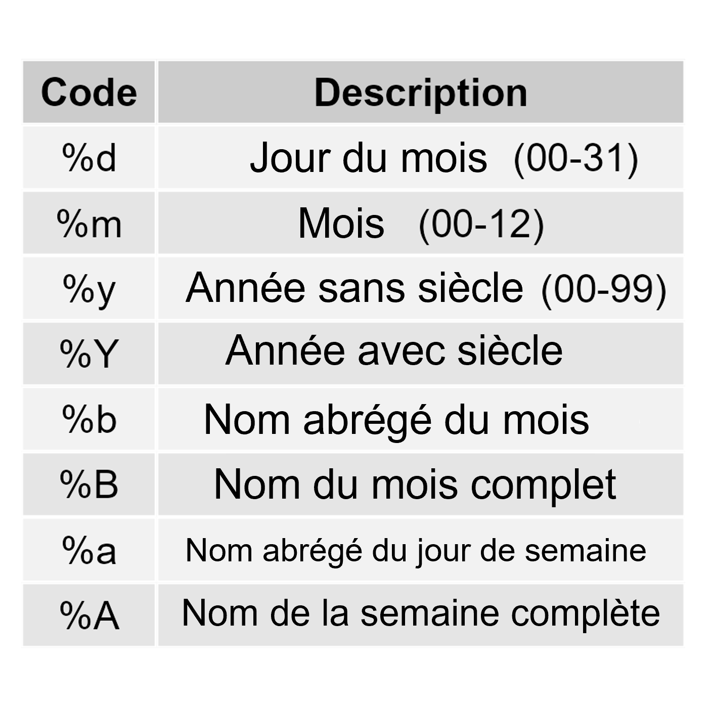

# Chargement des packages

```{r}
pacman::p_load(tidyverse, here, outbreaks)
```

# Données : Liste de cas d'Ebola en Afrique de l'Ouest

Aujourd'hui, nous utiliserons des données du package {outbreaks}. Exécutez le code ci-dessous pour charger un dataframe de liste de cas simulés d'Ebola pour l'Afrique de l'Ouest, 2014-1015.

*Notez que le jeu de données est en anglais!* 

```{r}
# Charger les données du package
ebola_wa <- outbreaks::ebola_sim_clean$linelist

# Inspecter le dataframe
#ebola_wa
```

**Point de contrôle** : Vous devriez avoir 5 829 lignes et 11 colonnes si vous avez chargé les données correctement ! Assurez-vous d'avoir le bon nombre de lignes et de colonnes lorsque vous inspectez le dataframe avant de continuer.

```{r}
# Examiner les classes de données de chaque variable
glimpse(ebola_wa)
```

Point clé : Nous avons plusieurs variables **date** qui pourraient être visualisées sur l'axe continu pour les histogrammes et les graphiques linéaires.

Utilisez la fonction `summary()` pour examiner les plages de dates dans cet ensemble de données.

```{r}
# Examiner les plages de variables
summary(ebola_wa)
```

Vous pouvez voir que les cas sont enregistrés du début de 2014 à la mi-2015. Les variables `date_of_hospitalisation` et `date_of_onset` sont les plus complètes (elles n'ont pas de NA), donc nous les utiliserons pour la visualisation dans cet exercice.

# Histogrammes

Premièrement, créez un histogramme de base avec 12 barres, montrant la distribution de la variable `date_of_hospitalisation`.

-   Choisissez une couleur de remplissage personnalisée et une couleur de contour pour les barres de votre histogramme (utilisez les couleurs de votre choix).

```{r}
ggplot(ebola_wa) +
  geom_histogram(aes(date_of_hospitalisation),
                 color = "white", fill = "darkred",
                 bins = 24)
```

Nous pouvons définir la largeur des compartiments pour cet histogramme comme d'habitude. Dans ce cas, puisque la variable est une date, la largeur des compartiments représente le **nombre de jours**.

-   Ajustez votre code pour tracer un histogramme avec des compartiments hebdomadaires (tous les 7 jours).

```{r}
ggplot(ebola_wa) +
  geom_histogram(aes(date_of_hospitalisation),
                 color = "white", fill = "darkred",
                 binwidth = 7) +
  labs(title = "Titre",
       x = "Date d'hospitalisation",
      y = "Numéro de patients")
```

-   Maintenant, élaborez le code du bloc précédent pour ajouter un titre de graphique pertinent et des étiquettes d'axe.

```{r}
ggplot(ebola_wa) +
  geom_histogram(aes(date_of_hospitalisation),
                 color = "white", fill = "darkred",
                 binwidth = 7) +
  labs(title = "Hospitalisations - compartiments de 7 jours",
       x = "Date d'hospitalisation",
      y = "Numéro de patients")
```

Lorsque vous tracez des dates, parfois les étiquettes d'axe par défaut peuvent ne pas être idéales. Dans ce graphique, `ggplot()` étiquette automatiquement l'axe des x tous les 4 mois, mais nous pourrions vouloir modifier cela. Dans les leçons préparatoires, vous avez appris à personnaliser les ruptures d'échelle en utilisant `scale_x_continuous(breaks = ...)`, mais pour les variables de date, nous utiliserons une méthode légèrement différente.

## Personnalisation de l'axe des dates avec `scale_x_date()`

*Dans cette section, continuez à construire sur le code que vous avez créé dans les blocs ci-dessus. De cette façon, vos histogrammes auront une apparence similaire, mais avec plus de détails ajoutés au fur et à mesure que vous progressez dans l'exercice !*

Vous pouvez personnaliser la fréquence des étiquettes de l'axe des dates en utilisant une fonction appelée `scale_x_date()` et en spécifiant `date_breaks`.

Par exemple, disons que nous voulons étiqueter l'axe tous les **deux mois**. Pour personnaliser les étiquettes, ajoutez simplement cette couche à votre code précédent :

```{r}
ggplot(ebola_wa) +
  geom_histogram(aes(date_of_hospitalisation),
                 color = "white", fill = "darkred",
                 binwidth = 7) +
  labs(title = "Hospitalisations - compartiments de 7 jours",
       x = "Date d'hospitalisation",
      y = "Numéro de patients") +
  scale_x_date(date_breaks = "2 months")
```

*Comme vous pouvez pouvez le constater, les spécifications valables de l'argument `date_breaks` en anglais et peuvent être 'sec', 'min', 'hour', 'day', 'week', 'month' ou 'year', éventuellement suivies de 's'.*

Vous remarquerez peut-être que les étiquettes des graduations de l'axe (alias le format de date) sont maintenant assez longues. Changeons le format de `YYYY-MM-DD` à `Mois-AA` à la place.

Pour personnaliser le format des dates, nous pouvons ajouter `date_labels` à l'intérieur de `scale_x_date()` et définir un format de date spécifique, comme ceci :

```{r}
ggplot(ebola_wa) +
  geom_histogram(aes(date_of_hospitalisation),
                 color = "white", fill = "darkred",
                 binwidth = 7) +
  labs(title = "Hospitalisations - compartiments de 7 jours",
       x = "Date d'hospitalisation",
      y = "Numéro de patients") +
  scale_x_date(date_breaks = "2 months", 
               date_labels = "%B %y") # voir le tableau ci-dessous pour explication
```

Lors de la personnalisation des formats de date dans {ggplot2}, nous utilisons des codes de lettres spécifiques pour représenter les différents composants d'une date. Voici quelques codes courants que vous pouvez donner à `date_labels` :



Maintenant, modifiez le format de date des étiquettes de l'axe sur l'histogramme précédent une dernière fois pour afficher **LES NOMS DES MOIS ABRÉGÉS** pour chaque mois.

```{r}
ggplot(ebola_wa) +
  geom_histogram(aes(date_of_hospitalisation),
                 color = "white", fill = "darkred",
                 binwidth = 7) +
  labs(title = "Hospitalisations - compartiments de 7 jours",
       x = "Date d'hospitalisation",
      y = "Numéro de patients") +
  scale_x_date(date_breaks = "1 months", date_labels = "%b")
```

# Graphique de série temporelle avec `geom_line()`

Créons un graphique linéaire pour examiner comment l'incidence d'Ebola a changé au cours de la période de cette étude, par date d'apparition des symptômes.

## Résumé des données pour le traçage

Tout d'abord, créez un dataframe résumé montrant le nombre de cas pour chaque **date d'apparition**, divisé par **résultat** (c'est-à-dire calculez le nombre total de cas regroupés par date d'apparition et résultat). Omettez les valeurs NA de votre tableau résumé avec la fonction `na.omit()`.

INDICE : Il y a plusieurs façons d'effectuer cette manipulation de données. Pour la méthode la plus efficace, consultez ces [notes de cours](https://the-graph-courses.github.io/data_untangled_wp/lessons/fr_ls05_groupby_summarize.html#92_dplyr::count()).

```{r}
ebola_wa_summary <- ebola_wa %>%
  count(date_of_onset, outcome) %>% na.omit() # ou groupby %>% summarize %>% ungroup

ebola_wa_summary
```

**Point de contrôle** : Votre tableau résumé devrait avoir 674 lignes et 3 colonnes.

## Graphique linéaire de série temporelle basique avec des données résumées

Maintenant, tracez un graphique linéaire montrant le nombre de cas par date d'apparition, et colorez les lignes par résultat.

```{r}
ggplot(ebola_wa_summary, aes(x = date_of_onset, 
                             y = n,
                             color = outcome)) +
  geom_line()
```

**Point de contrôle** : Votre graphique devrait maintenant avoir deux lignes : une pour les décès et une pour les cas rétablis.

Ensuite, apportez les modifications suivantes :

1)  Modifiez la largeur et la transparence de vos lignes.

2)  Utilisez `scale_x_date()` pour spécifier les ruptures de date et le formatage de votre choix.

3)  Ajoutez un titre, un sous-titre et modifiez les noms des axes.

4)  Changez le titre de la légende de "outcome" à "Résultat".

```{r}
ggplot(ebola_wa_summary, aes(x = date_of_onset, 
                             y = n,
                             color = outcome)) +
  geom_line(linewidth = 1, 
            alpha = 0.7) +
  scale_x_date(date_breaks = "2 months", date_labels = "%B") +
  labs(title = "Ebola cases in West Africa, 2014-2015",
       subtitle = "Grouped by outcome",
       x = "Date d'apparition",
       y = "Incidence",
       color = "Résultat")
```

# Défi bonus : Fonctions d'échelle de couleur

Saviez-vous que les fonctions `scale_*_()` sont également utilisées pour personnaliser les palettes de couleurs des graphiques `{ggplot2}` ?

Deux fonctions : `scale_color_manual()` et `scale_color_brewer()` sont des exemples pour ajuster les couleurs dans les tracés ggplot2 ! Faites des recherches en ligne sur le fonctionnement des fonctions pour compléter le défi bonus ci-dessous.

Tout d'abord, essayez de personnaliser les couleurs du graphique linéaire que vous avez précédemment créé avec `scale_color_manual()`. Commencez par comprendre les couleurs que vous souhaitez appliquer à votre graphique. Vous pouvez définir des couleurs spécifiques manuellement en utilisant des codes hexadécimaux ou en faisant référence à des noms de couleurs prédéfinis.

```{r}
# Ajustement des couleurs en utilisant scale_color_manual() 
ggplot(ebola_wa_summary, aes(x = date_of_onset, 
                             y = n,
                             color = outcome)) +
  geom_line(linewidth = 1, 
            alpha = 0.7) +
  scale_x_date(date_breaks = "2 months", date_labels = "%B") +
  labs(title = "Ebola cases in West Africa, 2014-2015",
       subtitle = "Grouped by outcome",
       x = "Date d'apparition",
       y = "Incidence",
       color = "Résultat") +
  scale_color_manual(values = c("Morts" = "indianred3",
                                "Récupérer" = "dodgerblue"))
```

Alors que `scale_color_manual()` nous permet de définir manuellement les couleurs, il est parfois difficile de choisir des couleurs visuellement attrayantes pour communiquer vos graphiques de manière significative.

Dans la plupart des cas, `scale_color_brewer()` est une meilleure option, fournissant des palettes prédéfinies pour des choix de couleurs faciles et esthétiquement agréables ! Vous pouvez explorer les palettes disponibles [ici](https://r-graph-gallery.com/38-rcolorbrewers-palettes.html).

(REMARQUE : `scale_color_brewer()` est une fonction d'échelle du package `RColorBrewer` dont les fonctions sont chargées avec `ggplot2` ! N'hésitez pas à explorer d'autres palettes intégrées à `ggplot2` par vous-même !)

Personnalisez les couleurs de votre graphique linéaire en utilisant la fonction `scale_color_brewer()`

 à la place ! (INDICE : Vous pouvez utiliser ce [LIEN](https://r-graph-gallery.com/38-rcolorbrewers-palettes.html) pour revoir les différentes palettes et les codes hexadécimaux)

```{r}
 # Ajustement des couleurs en utilisant scale_color_brewer() 
ggplot(ebola_wa_summary, aes(x = date_of_onset, 
                             y = n,
                             color = outcome)) +
  geom_line(linewidth = 1, 
            alpha = 0.7) +
  scale_x_date(date_breaks = "2 months", date_labels = "%B") +
  labs(title = "Ebola cases in West Africa, 2014-2015",
       subtitle = "Grouped by outcome",
       x = "Date of Onset",
       y = "Incidence",
       color = "Outcome") +
  scale_color_brewer(palette = "Set2")  
```
